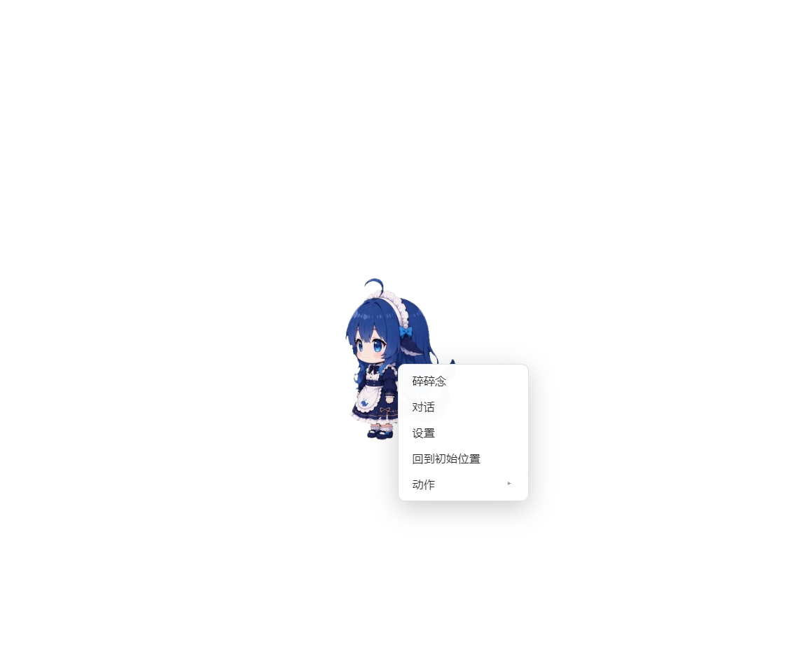
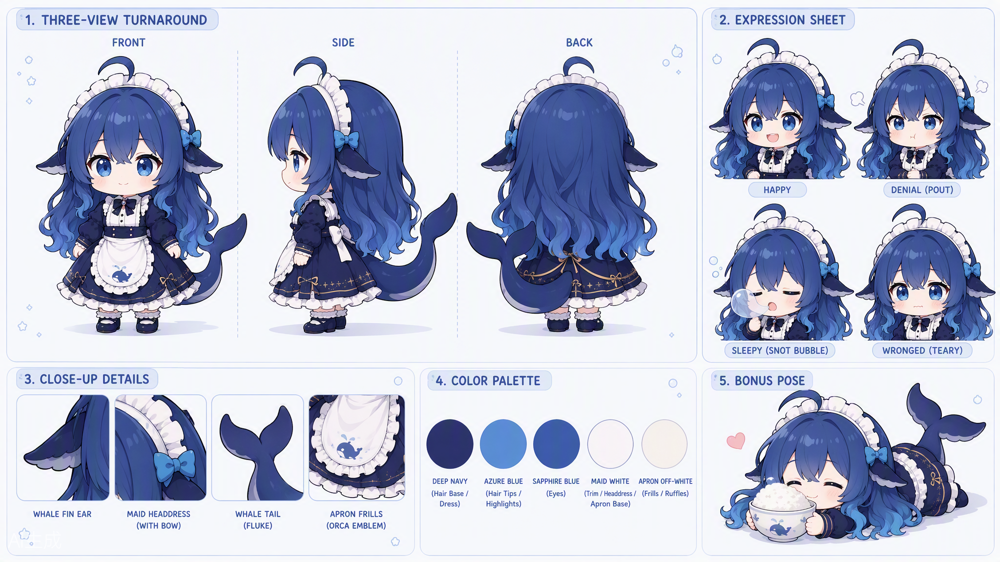

# dsh-pet-agent 🐾

一只**会管理你电脑**的桌面宠物：自制角色「小蓝」（蓝鲸女仆）桌宠外壳 +
DeepSeek Harness 内核 Agent 大脑。双击跟她聊天，她真的会用 pwsh、鼠标、
键盘、窗口管理帮你干活——查系统、管文件、开程序、操作 GUI，还能截图"看"
你的屏幕。



## 角色与素材：全部自制

桌宠形象「小蓝」——二头身 Q 版蓝鲸小女仆（渐变蓝卷发、环形呆毛、鱼鳍耳、
鲸鱼尾、白色褶边女仆头饰、藏青女仆裙、虎鲸刺绣白围裙）：



**动画、字体、图标素材 100% 自制**（AI 生成 + 自建抠像转码管线），不含上游
dsh-pet 项目的素材，不适用其「禁止商用」限制：

- **动画**：9 条 640×360 VP9-Alpha 透明 webm（12 动画制，坐姿抱膝/挂右边缘/
  挂顶边 3 条待补）——待机呼吸、东张西望、悠闲散步、被拖拽悬空、点击回应×3、
  跪坐干饭、趴地熟睡
- **字体**：站酷快乐体 2016（免费可商用授权）
- **图标**：手套拖拽光标 ×2 + 通知表情图标 ×6（均取自角色设定图）
- **设定图**：[三视图与表情](docs/images/character-design-sheet.png) ·
  [动作姿势表](docs/images/pose-sheet.png) · 更多见 `assets-custom/ref-src/`

生成管线（Kimi Work 出片 → 逐帧洪水抠像 → 规格校验 → 一键换血）详见
[docs/自制素材指南.md](docs/自制素材指南.md) 与
[assets-custom/QA-NOTES.md](assets-custom/QA-NOTES.md)。

## 特性

- **对话即命令**：右键/双击宠物打开对话框，自然语言下任务（「看看 C 盘剩余空间」「打开记事本写一句话」「列出内存占用前 5 的进程」）
- **Computer Use**：`computer_screenshot` 截图进模型视觉、`computer_click/move/drag` 控鼠标、`computer_type/key` 输文字按键、`window_list/focus` 管窗口、`app_open` 开程序、`clipboard_read/write` 剪贴板、`notify` 系统通知
- **pwsh 全家桶**：内核 Agent 自带 pwsh / fs / jobs / todo 工具
- **流式气泡**：正在思考… → 正在执行 pwsh… → 回复逐字出现
- **审批气泡**（可选）：越权操作在宠物上弹「允许一次/拒绝」确认框
- **跨重启记忆**：重启后她还记得你叫什么
- **设置卡**：右键 → 设置——开机自启（注册表 Run 键、无窗口启动）、模型配置（协议 / 接口地址 / API Key / 模型 id，桌宠独立配置，不跟随 dsh 部署默认）
- **内核即库**：不装 dsh CLI、不需要 monorepo——整个 [DeepSeek Harness](https://github.com/deepseek-ai/deepseek-harness) 内核作为普通 npm 依赖运行（`@deepseek-ai/*@0.1.2-rc.1`）

## 快速开始

```sh
pnpm install     # Electron 下载慢的话，.npmrc 已配 npmmirror 镜像
pnpm build       # tsc 编译到 lib/（首次或改动 src/ 后）
pnpm start       # = node lib/bin.js；开发期可用 pnpm dev（tsx 直跑 src/）
```

启动后宠物出现在桌面右上角。需要 Node.js ≥ 22.19 与 pnpm ≥ 10。

**模型配置**：右键桌宠 → 设置，填写接口协议（OpenAI 兼容 / OpenAI Responses / Anthropic）、接口地址（baseURL）、API Key 与模型 id 即可——支持 DeepSeek、通义、月之暗面、OpenRouter 等任何 OpenAI 兼容端点以及 Claude。API Key 写入凭据存储（`~/.dsh/.credentials.yaml`，0600），不进配置文件；未配置时对话会提示先完成设置（不再跟随 dsh 部署的默认模型）。

### 玩法示例

| 对她说 | 她做什么 |
|---|---|
| 「截个图看看你现在屏幕上有什么」 | computer_screenshot → 视觉模型直接看图；纯文本模型自动降级并用 window_list 复述 |
| 「打开记事本，输入『你好』」 | app_open → window_focus → computer_type（GUI 真实输入） |
| 「把这段话复制到剪贴板」 | clipboard_write，随处 Ctrl+V |
| 「10 秒后提醒我喝水」 | pwsh 定时 + notify 气泡通知 |

### 可选开关（启动前设环境变量）

| 变量 | 效果 |
|---|---|
| `DSH_PERMISSION_MODE=workspace-write` + `DSH_PET_APPROVAL=bubble` | 越权操作在宠物上弹审批确认框（默认 `danger-full-access` 全信任免打扰） |
| `DSH_PET_NO_ELECTRON=1` | 不起桌面窗口（无头调试，仅 HTTP 服务） |
| `DSH_PET_SMOKE_OUT=<path>` | 冒烟模式：延时截图后退出（CI 自检） |

## 架构

```
┌────────────────────────────────────────────┐
│ Electron 透明置顶窗口（dsh-pet 桌面壳）       │
│  动画 · 拖拽 · 菜单 · 对话/设置/审批弹窗      │
└──────────────┬─────────────────────────────┘
               │ HTTP 127.0.0.1（/dsh-pet-7340 路由契约）
┌──────────────▼─────────────────────────────┐
│ pet-server（cordis 插件）                    │
│  配置/素材/whisper/chat/settings/approval    │
└──────────────┬─────────────────────────────┘
               │ @deepseek-ai/* npm 包
┌──────────────▼─────────────────────────────┐
│ dsh 内核：agent-loop + LLM + 会话持久化       │
│  工具：pwsh · fs · jobs · todo · computer-use│
└────────────────────────────────────────────┘
```

## 自制素材管线（scripts/）

| 脚本 | 作用 |
|---|---|
| `key-video.py` | AI 视频 → 640×360 VP9-Alpha webm：逐帧边界洪水抠像（白/绿底通吃、不吃白围裙）、最大连通域去水印、全片统一裁剪窗防抖、绿幕「g 占优即背景」+ 去绿边 |
| `check-assets.ps1` | 校验配置引用的动画齐备、640×360、真 alpha、字体图标齐全 |
| `swap-assets.ps1` | 一键换血：内置素材移出备份 → 安装自制 webm/字体/图标/配置 |
| `convert-assets.ps1` | 纯绿幕片的 colorkey 快转（key-video.py 的轻量替代） |
| `make-ref.py` / `make-side-ref.py` / `make-pose-refs.py` | 从设定图裁绿幕/姿势锚图 |
| `qa-contact-sheet.py` | 品红衬底首/中/末帧拼图，一眼验收 |
| `gen-videos.ps1` / `gen-videos-kling.ps1` | 本地 ComfyUI Wan / 可灵 OpenAPI 批量生成（历史路线，已搁置） |

## 许可证与署名

- **本项目代码与 `assets/` 素材**: [MIT](LICENSE)——素材为自制（AI 生成 + 自建管线，
  见 [assets/README.md](assets/README.md)）
- **第三方**: 见 [NOTICE.md](NOTICE.md)——本项目代码是衍生作品：
  - [dsh-pet](https://github.com/PC2005-cloud/dsh-pet)（MIT 代码；桌面壳与
    shared-core 在本项目中有修改；**仅代码，不含其素材**）
  - [deepseek-harness](https://github.com/deepseek-ai/deepseek-harness)（MIT，内核经 npm 引用）
