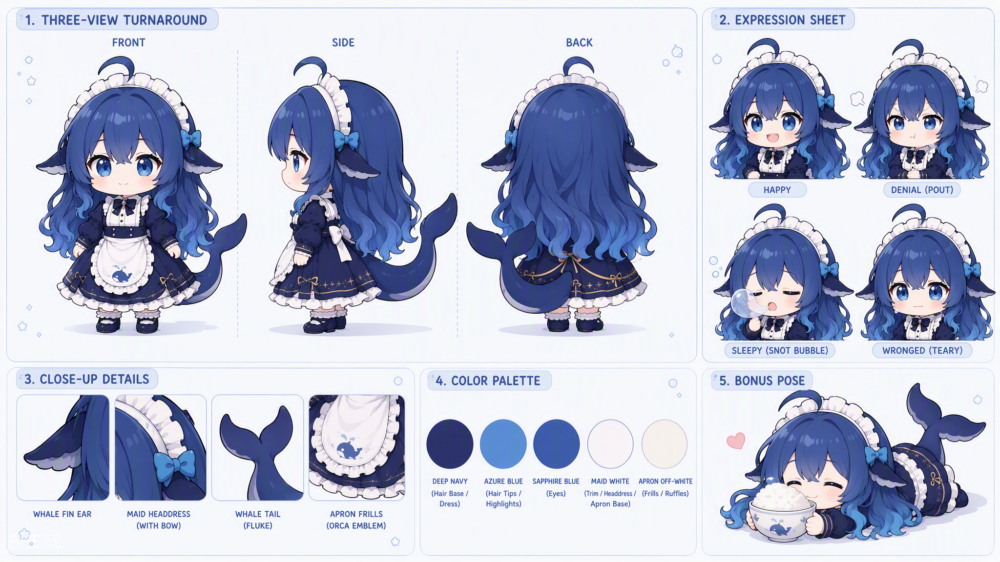
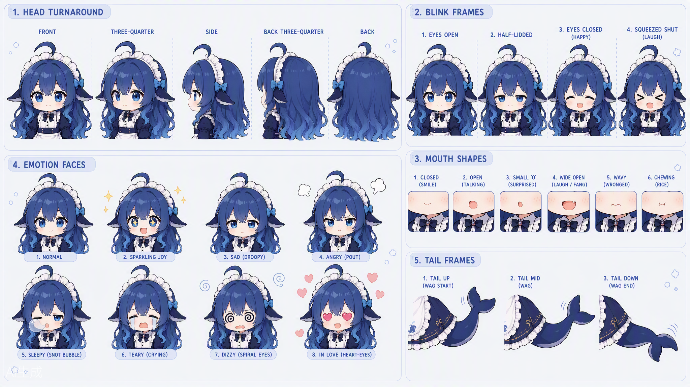
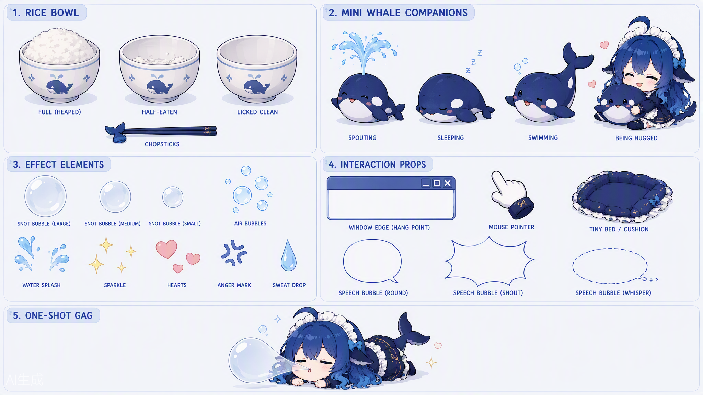

# DSH-PET-AGENT 🐾

一个**装在自己电脑上的独立 Agent**（基于 DeepSeek Harness 内核）：会聊天，也会真的
动手干活——pwsh 执行命令、读写文件、控鼠标键盘、管窗口、开程序、截图"看"屏幕。
**桌宠只是她的外壳**：一只角色站在桌面右上角，双击就说话。

**从素材到外壳都在这一个仓库里**：52 条动画逐条出片，设定图、表情图标与拖拽光标自己出图，
Electron 桌宠壳与外壳纯逻辑层可重建、可验收（`pnpm verify:shell`）。

> **独立运行**：不装 dsh CLI、不需要 monorepo，整个内核作为普通 npm 依赖跑在自己的
> 进程里。
> **自己的配置**：模型走她自己的一份——右键 → 设置里填协议 / 接口地址 / API Key /
> 模型 id，Key 进凭据库（`~/.dsh/.credentials.yaml`，0600），不进配置文件；会话记忆、
> 托盘、开机自启项也都是她自己的。
> **素材自己生产**：出片流程见 [`docs/动画生成清单.md`](docs/动画生成清单.md)，转码与验收见
> [`assets/README.md`](assets/README.md)。
> **外壳自己维护**：透明窗/物理/菜单/面板/气泡全在本仓库的 `shell/` 与
> `runtime/electron-helper/` 里，改了就跑 `pnpm verify:shell` 过闸，见
> [`shell/README.md`](shell/README.md)。

## 她是谁

一只 **Q 版蓝发鲸鱼女仆**：及腰大波浪（发根深蓝渐到发梢浅蓝）、头顶一根环形卷翘呆毛、
头两侧各一片鲸鱼鳍状大耳朵、身后拖着一条分叉的鲸鱼大尾巴；深藏青长袖女仆长裙配
白色荷叶边围裙（围裙上印虎鲸徽记），白短袜黑圆头小皮鞋。日系赛璐璐手绘风、粗描边。

| 角色设定图 | 表情 · 口型 · 尾巴帧 | 道具与特效 |
|---|---|---|
| <a href="docs/images/whale-maid-design-sheet.png"></a> | <a href="docs/images/whale-maid-expressions.png"></a> | <a href="docs/images/whale-maid-props.png"></a> |
| **三视图 · 表情 · 细节 · 配色板**<br>出片时的形象基准 | **头部转面 · 眨眼 4 帧 · 情绪脸 8 种 · 口型 6 种 · 尾巴 3 帧**<br>表情与作画参考 | **饭碗三态与筷子 · 迷你鲸鱼伙伴 · 特效元素 · 交互道具**<br>动画里的道具与特效出处 |

> 三张都在 [`docs/images/`](docs/images)，**点图看全尺寸**。它们是**本项目的自有素材**——
> 与全部动画同一套配色，`scripts/make-cursors.py` 的颜色常量就取自设定图那张的色板。
> 要换角色形象，改的是这三张图 + `assets/webm/` + 重跑 `make-tray-icon.py`。

## 她会什么

下面 6 条是挑出来展示的 —— **待机 · 点击回应 · 玩耍 ×2 · 小动作 · 工作状态**。全部
**52 条**在 `assets/webm/`（转向、移动、吃什么、文字等池也都有），VP9-Alpha，
**实机播放时是透明背景**。

| **待机** · 整理仪容 | **点击回应** · 生气跺脚 | **玩耍** · 铃鼓欢拍 |
|---|---|---|
|  |  |  |
| **玩耍** · 吹笛子 | **小动作** · 趴地熟睡 | **工作状态** · 冒泡思考 |
|  |  |  |

> 这些 GIF 是**给 README 看的预览**，由 `python scripts/make-previews.py` 从
> `assets/webm/` 生成（以引擎角色框为中心取方窗 → 缩到 180×180，见
> [`assets/README.md`](assets/README.md)）。GIF 只有 1 位透明，边缘比原片略硬；
> 想要原画质直接开 `assets/webm/` 里的 webm，或把某条动画挂进自己的 README ——
> 挑哪几条由脚本里的 `CURATED` 决定。

## 特性

- **对话即命令**：右键/双击宠物打开对话面板，自然语言下任务（「看看 C 盘剩余空间」「打开记事本写一句话」「列出内存占用前 5 的进程」）
- **气泡式聊天（默认）**：聊天只有**一条小输入条**（回车发送，跟早期那版一样），发完自动收起，她在**头顶气泡**里逐字把话说完——更像在跟人说话。气泡按字数给阅读时间（约 4.5 字/秒，最短 4 秒、最长 30 秒），**没读完不会被下一句顶掉**：后来的消息排队，碎碎念遇到真回复直接让路；一句话说完的长回复自动**分屏**，一屏一屏翻。想改成面板形式（能回看记录）在设置卡里切「对话形式」即可
- **常驻对话面板**（可选形式）：发完不消失——你的话和她的话都留在面板里，可以连续追问；关掉再打开会回放最近几轮（内核进程重启后面板从空开始，但**她自己的记忆**在会话日志里，跨重启仍在）。回复**逐字流式**出现，过程中显示「正在思考…／正在执行 pwsh…」，跑偏了可以按「停止」中断，失败了点「重试」原地重发。模型若把**思考过程混进正文**（部分推理模型/端点会把 `…思考…</think>正文` 整段当 content 流出来），宿主会自动剥掉，气泡里只留要说的话。面板**跟着她走**：拖她/甩她/回位都会重新贴到身边；贴到屏幕边缘会**翻边**（右侧放不下就贴左侧），两侧都窄就把面板压窄——绝不跑出屏幕
- **Computer Use**：`computer_screenshot` 截图进模型视觉、`computer_click/move/drag` 控鼠标、`computer_type/key` 输文字按键、`window_list/focus` 管窗口、`app_open` 开程序、`clipboard_read/write` 剪贴板、`notify` 系统通知
- **pwsh 全家桶**：内核 Agent 自带 pwsh / fs / jobs / todo 工具
- **系统托盘**：左键单击显示/隐藏桌宠，右键出**极简菜单——只有「隐藏/显示桌宠」与「退出桌宠」**（其余动作都在宠物右键菜单里：对话 / 设置 / 碎碎念 / 回到初始位置；开机自启在「设置」卡里）。桌宠窗口是无边框、无任务栏项的穿透小窗，托盘是它唯一的「找回」与「退出」入口
- **两种退出方式**：托盘菜单或宠物右键菜单的「退出桌宠」——都先请内核 dispose 整棵插件树，再结束 Electron 外壳，不留孤儿进程
- **甩出去会弹，撞哪压哪**：把她拎起来甩出去 → 重力下落 + 碰墙/碰顶/落地按 `restitution` 反弹（`assets/config.jsonc` 的 `physics` 可调：`gravity` / `restitution` / `groundFriction` / `ceilingBounce` / `throwPower`）。碰撞瞬间有 **Q 弹挤压反馈**：撞左右墙横向压、撞顶竖向压、落地竖向压，压扁深度按冲击速度取（`landingSquash`：<300px/s 轻落、≥1500px/s 压到 0.55，220ms 回弹带 ~4% 过冲），**被撞的那条边钉住不动**、另一侧压进来；轻擦（<600px/s）不留反馈，免得贴墙滑行一路抖。系统开了「减少动态效果」时整条反馈跳过。多宠互撞另由 `petCollision` 管（默认关，开启后按动量守恒弹开）
- **审批气泡**（可选）：越权操作在宠物上弹「允许一次/拒绝」确认框
- **跨重启记忆**：重启后她还记得你叫什么
- **设置卡**：右键 → 设置——**分两级**：主页是常用开关（开机自启、对话形式，两者都是**改一下立刻单独保存**，不跟模型配置捆在一起），「模型配置…」进二级页填协议 / 接口地址 / API Key / 模型 id（桌宠独立配置，不跟随 dsh 部署默认）。字段区高度有上限、超出内部滚动，所以保存按钮永远留在屏幕内
- **内核即库**：不装 dsh CLI、不需要 monorepo——整个 [dsh-kernel](https://github.com/YenWuLiu/dsh-kernel-0.1.2-rc.1) 内核作为普通 npm 依赖运行（`@deepseek-ai/*@0.1.5-rc.2`）

## 快速开始

### 一、直接用（不碰代码走这条）

| 产物 | 体积 | 说明 |
|---|---|---|
| [**`DSH-PET-AGENT-0.1.0-setup.exe`**](https://github.com/YenWuLiu/dsh-pet-agent/releases/tag/v0.1.0) | 286 MB | **NSIS 安装版（推荐）**：按用户装到 `%LOCALAPPDATA%\Programs`，**不需要管理员权限**；可改安装路径，带开始菜单 / 桌面快捷方式与卸载项。冷启动约 2 秒 |
| [`dsh-pet-agent-0.1.0-win-unpacked.zip`](https://github.com/YenWuLiu/dsh-pet-agent/releases/tag/v0.1.0) | 373 MB | **免安装绿色版**：解压后直接跑 `win-unpacked\DSH-PET-AGENT.exe`，冷启动同样约 2 秒 |

> 两个包都在 [**Releases → v0.1.0**](https://github.com/YenWuLiu/dsh-pet-agent/releases/tag/v0.1.0)，
> 同一页有 `SHA256SUMS.txt` 可核对；两者是**同一个构建**的两种打包方式。
> **不需要装 Node.js 与 pnpm** —— 内核与 node 运行时都打包在里面了。
> 系统要求：Windows 10 / 11 **x64**。

装好后：右键宠物 → 设置 → 「模型配置…」填协议 / 接口地址 / API Key / 模型 id，
双击宠物就能说话；右键 → 动作可以点播全部 52 条动画。

### 二、从源码跑

```sh
pnpm install     # Electron 下载慢的话，.npmrc 已配 npmmirror 镜像
pnpm build       # tsc 编译到 lib/（首次或改动 src/ 后）
pnpm start       # = node lib/bin.js；开发期可用 pnpm dev（tsx 直跑 src/）
```

启动后宠物出现在桌面右上角，系统托盘出现她的头像。需要 Node.js ≥ 22.19 与 pnpm ≥ 10。

> 上面这条链只覆盖 host 侧（`src/` → `lib/`）。**改了外壳的纯逻辑层 `shell/` 要另外重建产物并过闸**：
> `pnpm verify:shell` 一次跑完十一道闸——思考剥离 → `shell/` 类型检查 → PS 脚本 BOM → 产物自检 →
> 界面字体闸 → 新旧产物差分 → 菜单夹取 → 面板落位 → 气泡节奏 → 穿透兜底 → 面板 55 项断言。
> 只改了 `shell/` 时要先 `pnpm build:desktop-core` 重建产物（改了 `src/` 则是 `pnpm build`）。
> 详见 [`shell/README.md`](shell/README.md)。

**模型配置**：右键桌宠 → 设置，填写接口协议（OpenAI 兼容 / OpenAI Responses / Anthropic）、接口地址（baseURL）、API Key 与模型 id 即可——支持 DeepSeek、通义、月之暗面、OpenRouter 等任何 OpenAI 兼容端点以及 Claude。API Key 写入凭据存储（`~/.dsh/.credentials.yaml`，0600），不进配置文件；未配置时对话会提示先完成设置。

### 可选开关（启动前设环境变量）

| 变量 | 效果 |
|---|---|
| `DSH_PERMISSION_MODE=workspace-write` + `DSH_PET_APPROVAL=bubble` | 越权操作在宠物上弹审批确认框（默认 `danger-full-access` 全信任免打扰） |
| `DSH_PET_NO_ELECTRON=1` | 不起桌面窗口（无头调试，仅 HTTP 服务） |
| `DSH_PET_SMOKE_OUT=<path>` | 冒烟模式：延时截图后退出（CI 自检） |
| `DSH_PET_CHAT_SMOKE=1` | 冒烟模式附加项：脚本驱动一轮对话，把面板状态写进 `<冒烟输出>.chat.json` |

## 打包为 exe

```sh
.\scripts\pack-exe.ps1
```

> 也可以**双击仓库根的 [`打包.bat`](打包.bat)**：它会先跑素材验收 + `pnpm verify:shell`
> 两道前置闸，再调上面这个脚本；带 `fast` 参数跳闸、`clean` 参数只清中间产物。

> ⚠️ **改 `scripts\pack-exe.ps1` 时必须保留文件开头的 UTF-8 BOM**（`EF BB BF`）。
> Windows PowerShell 5.1 读**无 BOM** 的 `.ps1` 会按系统 ANSI（中文机器上是 GBK）解码，
> 中文注释与字符串立刻变乱码，脚本直接语法错误、打包失败——本脚本踩过这个坑。
> 用能保留 BOM 的编辑器改；改完可这样自检：
> `[System.Management.Automation.Language.Parser]::ParseFile($path, [ref]$null, [ref]$errs)`。

产出两份可直接分发的东西（`dist/`，附 `SHA256SUMS.txt`）：

| 产物 | 用途 | 冷启动 |
|---|---|---|
| `DSH-PET-AGENT-<ver>-setup.exe` | **NSIS 安装版**：按用户装到 `%LOCALAPPDATA%\Programs`，无需管理员，带开始菜单/桌面快捷方式与卸载项 | ~2 秒 |
| `win-unpacked\DSH-PET-AGENT.exe` | 免解包直跑目录（同一份内容），适合绿色部署 | ~2 秒 |

> 只出安装版（2026-09 起）：早先那个单文件 portable 版每次启动都要把 ~260 MB 的 app
> 解包到 `%TEMP%`，冷启动实测约 3 分钟——拿来「开机自启」体验很差，已去掉。
> 要绿色部署就用 `win-unpacked`（免安装、启动一样快）。

**发布到仓库**：这两个产物都不进 git —— 安装版 286 MB、绿色版解压后 823 MB，
**都超过 GitHub 单文件 100 MB 的硬上限**（`dist/` 也本来就是 gitignore 的）。
发布走 **GitHub Release 附件**：

```sh
# dist/win-unpacked 压成绿色版 zip，然后连同安装版一起传上去
cd dist; tar -a -cf dsh-pet-agent-<ver>-win-unpacked.zip win-unpacked
gh release upload v<ver> DSH-PET-AGENT-<ver>-setup.exe dsh-pet-agent-<ver>-win-unpacked.zip SHA256SUMS.txt
```

> 上传前**先核对 `SHA256SUMS.txt` 与产物对得上**，并抽一两个文件从 zip 里解出来做逐字节比对 ——
> 几百 MB 的包传到一半坏了，只有下载的人会发现。
> 当前发的是 [**Releases → v0.1.0**](https://github.com/YenWuLiu/dsh-pet-agent/releases/tag/v0.1.0)，
> 见上面的「快速开始 → 一、直接用」。

### 对话面板自检

```sh
node tools/chat-smoke/panel-test.mjs        # 55 项断言，无需 Electron / 桌面会话
```

## 架构

```
┌────────────────────────────────────────────┐
│ Electron 进程 A：桌宠壳（runtime/electron-helper）│
│  透明置顶小窗 · 动画 · 拖拽 · 菜单 · 对话/设置 │
│  · 审批弹窗 · 系统托盘（只有 显示/隐藏 · 退出）  │
└──────────────┬─────────────────────────────┘
               │ HTTP 127.0.0.1（/dsh-pet-7340 路由契约）
┌──────────────▼─────────────────────────────┐
│ pet-server（cordis 插件，node 进程）          │
│  配置/素材/whisper/settings/approval         │
│  chat（GET 转录 · POST 整轮 · /chat/stream   │
│   NDJSON 流式 · /chat/cancel 中断 turn）      │
│  /quit ← 托盘「退出桌宠」的有界退出入口        │
└──────────────┬─────────────────────────────┘
               │ @deepseek-ai/* npm 包
┌──────────────▼─────────────────────────────┐
│ dsh 内核：agent-loop + LLM + 会话持久化       │
│  工具：pwsh · fs · jobs · todo · computer-use│
└────────────────────────────────────────────┘
```

外壳自身再分两层：`runtime/electron-helper/` 是 Electron 侧（窗口、渲染、菜单、托盘），
`shell/` 是它的**纯逻辑层源码**（物理、几何、菜单树、气泡节奏、对话面板覆盖层），
`pnpm build:desktop-core` 把 `shell/` 打成 `runtime/electron-helper/shared-core.js` 供渲染层消费。

## 素材与授权

**`assets/` 里的素材全部由本项目自制**——动画、设定图、表情图标、拖拽光标、托盘与应用图标
都是自己出片或自己生成的，每个都能重建（生成脚本随仓库走）。代码按 [MIT](LICENSE)；
第三方署名与完整条款见 [`NOTICE.md`](NOTICE.md)。

| 内容 | 是什么 | 怎么来的 | 授权 |
|---|---|---|---|
| `assets/webm/` | **52 条动画**：待机 2 · 转向 1 · 点击回应 3 · 移动 1 · 小动作 15 · 玩耍 21 · 吃什么 2 · 文字 1 · 工作状态 6 | 手扣母版 → `python scripts/normalize-webm.py` 归一化出片 | 本项目自制，随代码 MIT |
| `assets/preview/` | **6 条预览 GIF**（README 里展示的那 6 条，180×180、各 0.6~0.9 MB） | `python scripts/make-previews.py` 从 `assets/webm/` 生成 | 本项目自制，随代码 MIT |
| `docs/images/whale-maid-*.png` | **角色设定图 ×3**：角色设定（三视图 / 表情 / 细节 / 配色板）、表情与作画参考（头部转面 / 眨眼 4 帧 / 情绪脸 8 种 / 口型 6 种 / 尾巴 3 帧）、道具与特效（饭碗三态 / 迷你鲸鱼伙伴 / 特效元素 / 交互道具） | 本项目自己出图，是出片与配色的事实来源 | 本项目自制，随代码 MIT |
| `assets/pic/notify-*.png` | 通知表情图标 ×6（完成 / 出错 / 提问 / 审批 / 截断 / 自检），256×256 | 本项目自己出图 | 本项目自制，随代码 MIT |
| `assets/pic/cursor-*.png` | 拖拽光标 ×2（张开 / 握起），32×32，热点 (16,16) | `python scripts/make-cursors.py` 生成 | 本项目自制，随代码 MIT |
| `runtime/electron-helper/tray.png`<br>`packaging/app.ico` | 托盘图标 32×32、应用图标（16~256 共 7 档） | `python scripts/make-tray-icon.py` 从 `notify-done.png` 派生 | 本项目自制，随代码 MIT |
| `assets/fonts/上首软糖体.ttf` | 界面字体 **站酷快乐体 2016**（HappyZcool-2016），**唯一非自制项** | 第三方字库 | 版权方条款（内嵌声明 © LuiBingKe 2016），**不适用** MIT |
| `assets/config.jsonc` | 动画池 / 物理 / 联动的**唯一事实来源** | 本项目自己维护，只引用已出片的 52 条 | 随代码 MIT |

> 文件名 `上首软糖体.ttf` 是渲染端**硬编码的槽位名**（不代表字体身份）：换字库时保持文件名
> 不变即可，字面身份由 `scripts/inspect-font.mjs` 那道闸盯着。
> 换角色形象后要重跑 `make-tray-icon.py` —— 忘了就还是上一个角色的脸挂在托盘上。

**当前进度（2026-09-24）**：`assets/webm/` **52 条**，合计 **82.6 MB**。母版是 `素材加工\` 下
那批**手扣、自带 alpha 通道**的 HEVC MOV（752×560 / 864×496 / 560×752，30fps，10.07~10.09s），
经 `scripts/normalize-webm.py` 归一化成 640×360 VP9-Alpha。`assets/config.jsonc` **只引用这
52 条**，`scripts/check-assets.ps1` **三项全绿**：配置共引用 52 个动画、0 个缺文件、全部
640×360 带 alpha，锚点契约 51 条全部达标（最大偏差 3px，容差 ±8px）。

**最近三批（+14 条，38 → 52）**：`尤克里里弹唱` / `铃鼓欢拍` / `小号吹奏` / `手风琴拉奏`
（乐器补充篇）、`星夜换装` / `樱色换装` / `糖果换装` / `万圣换装` / `新年换装` / `大小姐换装`
（换装补充篇）、`芭蕾小跳` / `芭蕾踮脚旋转`（舞蹈补充篇）、**`待机-整理仪容`（待机补充篇
——`idle` 池第一次有第二条）**、**`点击回应-生气跺脚`（点击回应补充篇——`clicks` 第三条）**。
分池**按动作语义**、不按生成批次槽位（补充文档里的「槽位统一 小动作」指的是 `prompts.json`
那个生成批次桶）：舞蹈与乐器进「玩耍」，换装进「小动作」；分类权重按条数重算为
31/43/4/2（仍守恒 80）。

> **idle / clicks 有两条 check-assets 守不住的契约**（它只查齐备 / 规格 / 锚点），
> 得手工量，口径见 [`docs/动画设计与衔接规范.md`](docs/动画设计与衔接规范.md) §8
> （640×360、只在两帧前景并集上取 `mean(|Δ|)`、不做任何对齐）：
> `idle` 要求**首尾无缝**（链式重滚，滚回时不能跳），`clicks` 要求**末帧 ≈ 中立站姿**。
> 本批实测：`待机-整理仪容` 接缝比值 **3.4×**（比 `休闲待机` 的 4.0× 还好，且接缝 9.90
> **小于它自己最差的相邻帧差 12.78**）；`点击回应-生气跺脚` 首尾差 9.69，与已有两条
> （9.26 / 9.63）同量级。两条都合格。

> **要跑这条管线，先装 ffmpeg**：`.\scripts\get-ffmpeg.ps1`。它是管线硬依赖
> （`normalize-webm.py` / `check-assets.ps1` / `check-anchor.py` / `make-previews.py` 都调它），
> 但单个文件 100~212 MB，**不进版本管理** —— 新克隆的仓库没有它，不装就跑不了出片。详见
> [`tools/README.md`](tools/README.md)。

> ⚠ **一条踩过的坑（2026-09-23）**：早期出片脚本里带 `colorkey=0x00FF00:0.1:0.1`（绿幕键），
> 而母版是**手扣好、自带 alpha** 的 MOV。`colorkey` 只按 RGB 工作，会**丢弃输入 alpha、
> 按 RGB 重新生成一张**——键色 `#00FF00` 在这些母版的**透明黑底**上匹配不到任何像素，于是
> 新 alpha 全是 255，**成片完全不透明**（容器还照旧带 `alpha_mode:1`，实机才发现没有透明
> 通道）。实测同一份母版首帧透明占比 **0.8196 → 0.0000**。结论：**手扣好的 MOV 永远不要
> 再 key 一次**——只有绿幕片才需要先 chromakey 再编码。素材一律**直接从 MOV 母版归一化**，
> 既拿到真 alpha，又少一代有损编码。编码用 **CRF 15**（2026-09-23 从 20 下调，实测显示
> 尺寸 +1.19 dB），52 条合计 **82.6 MB**（上一版从被抠坏的 webm 转的是 70.6 MB —— 更小且
> 更清晰）。

> **上一批（38 条）相对其上一版的变化**：素材从 14 条增加到 38 条。`turn` / `clicks` 两个池子**第一次
> 被填上**（`animationWeights.turn` 从 0 给回 5），宠物现在会真的转身（`facing` 会翻转）；
> `深度思考碎碎念` 带中文对话气泡，是唯一必须 `noMirror` 的动画，已单独归进「文字」类；
> **`events.workStatus` 六档也齐了**（冒泡思考/忙碌点按/清点归档/原地踱步张望/雀跃庆祝/
> 垂头叹气冒汗），所以 `workStatusEnabled` 已打开。上一版两条锚点超差（`整体换装试色`
> 脚底 −19px、`小提琴演奏` 脚底 −11px）随重出素材一并消失。

## 与 dsh-pet 的关系

**dsh-pet（[PC2005-cloud/dsh-pet](https://github.com/PC2005-cloud/dsh-pet)）是本项目的灵感来源**：
"桌宠外壳 + Agent 内核"这个分工、以及**动画生成提示词**（形象段 / 动作段那套模板）都从它起步。
本项目是它的**独立发行版**，最终版就是这一个仓库——本机另外几份（`DSH-PET`、
`Archive-DSH Pet Agent`）都是开发过程的实验产物，不对外发布。

它**不提供智能**：对话 / 碎碎念 / 工作状态 / 工作状态动画联动，全部是本项目自己的 host 与
agent 实现（上游那套 `ctx.llm` 宿主层一行没用）；它**也不提供素材**：52 条动画、设定图、
图标、光标、托盘图都是本项目自己出片的。

> **代码上有一处必须如实交代的沿用**：`shell/shared/` 的 16 个纯逻辑文件是 dsh-pet
> **v0.2.11 `src/shared/*.ts` 的逐字节副本**（故意保持逐字节，好让将来还能整体 diff / 升级），
> `runtime/electron-helper/` 与 `src/vendor/` 也都是在它之上改的。这部分按 MIT 保留署名，
> 完整范围与逐项差异见 [`NOTICE.md`](NOTICE.md) §1 与 [`shell/README.md`](shell/README.md)
> 的覆盖清单。除此之外的代码与全部素材都归本项目。

本机若同时留着实验版，两者**完全隔离、可同时运行**（端口与状态目录都分开）：

| 身份项 | 本项目（DSH-PET-AGENT） | 实验版 DSH-PET |
|---|---|---|
| npm 包名 / cordis NAME | `dsh-pet-agent` | `dsh-pet` |
| HTTP 端口 | **7341** | 7340 |
| 状态目录（模型配置 / 会话记忆） | `~/.dsh/dsh-pet-agent-v2/` | `~/.dsh/dsh-pet-agent/` |
| 开机自启 Run 值 | `DshPetAgent` | `DshPet` |
| appId / 产品名 | `com.yenwuliu.dsh-pet-agent` / `DSH-PET-AGENT` | `com.yenwuliu.dsh-pet` / `DSH-PET` |

> **注意：两份状态是分开的**——API Key 与模型配置要在本项目里重新填一次
> （Key 进同一个凭据库 `~/.dsh/.credentials.yaml`，但模型配置各存各的）。
>
> **路由前缀 `/dsh-pet-7340` 是历史命名**：它在渲染端与 HTTP 契约里写死，只是个路径命名
> 空间。两个进程**端口不同即不冲突**，所以没必要改前缀——真要改，跟着
> `src/server.ts` 的 `ROUTE_PREFIX` 一起改即可。

## 目录速查

| 路径 | 作用 |
|---|---|
| `assets/` | 素材包 + `config.jsonc`（动画池/物理/联动的唯一事实来源）。动画、预览 GIF、规格契约与生成脚本见 [`assets/README.md`](assets/README.md) |
| `docs/images/` | **角色设定图 ×3**（角色设定 / 表情作画参考 / 道具与特效），自有素材，出片与配色的基准 |
| `runtime/electron-helper/` | Electron 桌宠壳（透明窗、渲染、菜单、托盘）；其中 `shared-core.js` 是 **构建产物** |
| `shell/` | 外壳纯逻辑层源码：`shared/`（常量/选择器/多屏几何/运动/物理/配置拍平/菜单/气泡等纯逻辑）+ `ours/`（本项目自己的实现：常驻流式对话面板、面板落位、气泡节奏、菜单夹取）+ `legacy/`（旧产物基准）；`pnpm build:desktop-core` 产出上面那个 `shared-core.js`。详见 [`shell/README.md`](shell/README.md) |
| `src/` | host 侧 TS：`bin.ts`（内核组合入口）、`server.ts`（HTTP 路由）、`computer-use.ts`、`model-config.ts`、`autostart.ts`、`vendor/` |
| `scripts/` | **17 个脚本**：素材管线 7 + 外壳验收闸 9 + 打包 1。清单、作用、何时跑见 [`scripts/README.md`](scripts/README.md) |
| `docs/` | 动画提示词模板与补充篇、引擎衔接规范、形象设定图；**文档总入口是 [`docs/README.md`](docs/README.md)** |
| `packaging/` | `electron-builder.yml`、`launcher.cjs`（打包版启动器）、`app.ico`；`staging*/` 是组装中间产物，可随时清（`打包.bat clean`） |
| `tools/` | `ffmpeg.exe`（**不进版本管理**，用 `scripts/get-ffmpeg.ps1` 装）+ `chat-smoke/` 面板自检。见 [`tools/README.md`](tools/README.md) |
| `licenses/` | 第三方许可证全文（DeepSeek Harness、dsh-pet 等）；适用范围与署名见 [`NOTICE.md`](NOTICE.md) |
| `patches/` | pnpm `patchedDependencies`（node-pty 补丁） |
| `lib/` | `pnpm build` 的产物（`cordis.patch.prod.yml` 指向这里） |
| `dist/` | `scripts/pack-exe.ps1` 的产物：安装版 exe + `win-unpacked/` |

> 素材生产（提示词 → 抠像 → 归一化 → 验收 → 上机）的完整链路画在
> [`docs/README.md`](docs/README.md) 里。

## 许可证

- **代码**（含桌宠外壳与内核组合层）: [MIT](LICENSE)
- **素材**（`assets/webm/` 动画、`assets/preview/` 预览、`docs/images/` 设定图、
  `assets/pic/` 图标与光标、托盘与应用图标）: 本项目自制，随代码按 MIT 处理
- **界面字体**（`assets/fonts/上首软糖体.ttf`）: 第三方字库**站酷快乐体 2016**
  （HappyZcool-2016，© LuiBingKe 2016），按版权方条款使用，**不适用** MIT
- 第三方代码署名、字体与依赖的完整条款见 [`NOTICE.md`](NOTICE.md)
